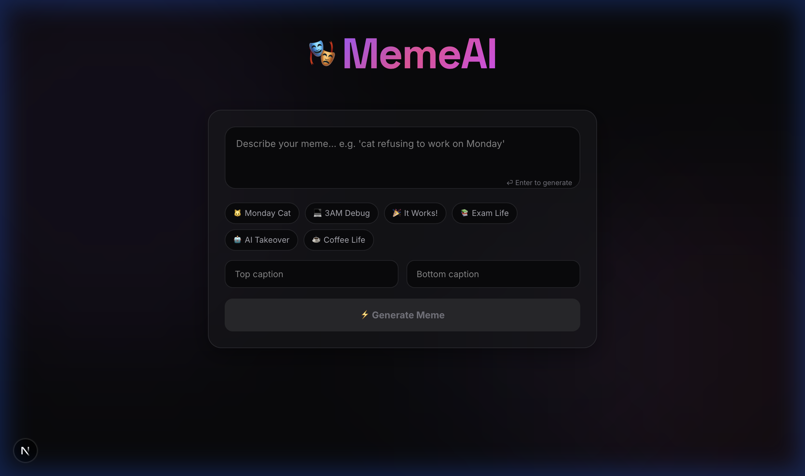
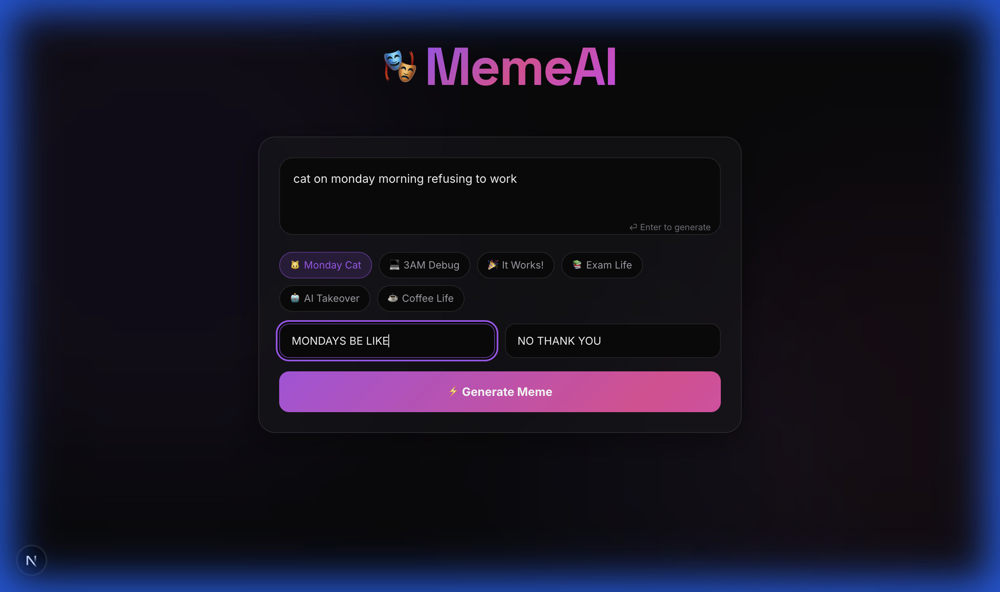
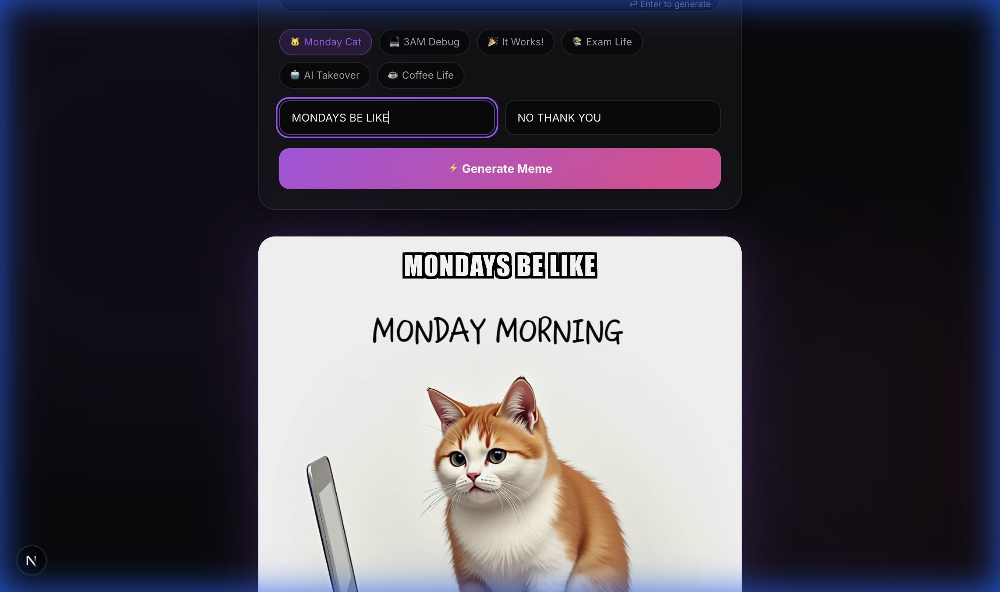
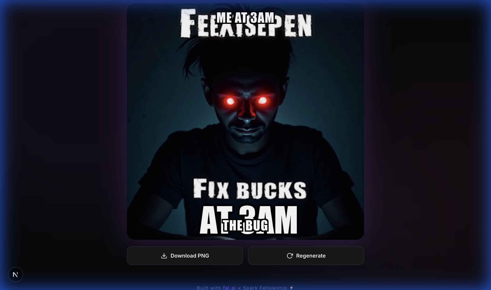

# 🎭 MemeAI — Project Showcase

## App Description

**MemeAI** is an AI-powered meme generator that lets users create viral-worthy memes in seconds. Users type a text description of the meme they want, the AI generates a matching image, and users can overlay classic top/bottom captions before downloading the final meme as a PNG.

### Key Features

- **AI Image Generation** — Describe any meme concept in plain text and get a unique, AI-generated image in ~10 seconds.
- **Quick Prompt Templates** — Six one-click presets (Monday Cat, 3AM Debug, It Works!, Exam Life, AI Takeover, Coffee Life) for instant inspiration.
- **Top & Bottom Captions** — Classic meme-style text overlay using Impact font with bold black outlines, rendered directly on the image.
- **PNG Download** — Export the finished meme (image + captions) as a PNG file with a single click.
- **Regenerate** — Not happy with the result? Hit Regenerate to get a new variation from the same prompt.
- **Premium Dark UI** — Glassmorphism card design, animated ambient background blobs, gradient accents, and smooth micro-animations.

---

## Screenshots

### 1. Home Page — Clean State
The landing view where users start. Features the gradient MemeAI header, a prompt textarea with placeholder text, six quick-prompt chips, top/bottom caption inputs, and the Generate Meme button (disabled until a prompt is entered).



---

### 2. Filled Form — Ready to Generate
After clicking the "Monday Cat" quick prompt chip, the prompt textarea is filled with `cat on monday morning refusing to work`. The selected chip is visually highlighted in purple. Captions "MONDAYS BE LIKE" and "NO THANK YOU" are typed in. The Generate Meme button is now active with a purple-to-pink gradient.



---

### 3. Generated Meme — Result with Captions
The AI has generated an image of a cat on Monday morning. The top caption "MONDAYS BE LIKE" is overlaid in Impact font with black text-shadow outlines. The image is displayed in a rounded card with a subtle purple glow shadow.



---

### 4. Full Meme View — With Action Buttons
Scrolled down to show the complete meme with both top and bottom captions rendered on the image, along with the "Download PNG" and "Regenerate" action buttons below.



---

## fal.ai Model Usage

### Model: `fal-ai/flux/dev`

MemeAI uses the **FLUX (Dev)** image generation model hosted on fal.ai. FLUX is a state-of-the-art text-to-image model that produces high-quality, detailed images from text prompts.

**Why FLUX?**
- High-quality output with strong visual coherence
- Good understanding of humor and situational concepts (important for memes)
- Fast generation times (~8–12 seconds per image)
- Square HD output format ideal for social media memes

### How the API is Used

The integration happens through a **server-side Next.js API route** (`app/api/generate/route.ts`) that acts as a secure proxy between the frontend and fal.ai:

```
User Input → Next.js API Route → fal.ai FLUX Model → Generated Image URL → Frontend Preview
```

#### Step-by-step flow:

1. **User enters a prompt** (e.g., `"cat on monday morning refusing to work"`)

2. **Frontend sends a POST request** to `/api/generate` with the raw prompt

3. **The API route enhances the prompt** by prepending meme-optimized keywords:
   ```
   "meme style, internet humor, funny, viral reddit meme, {user_prompt},
    white space for caption text at top and bottom, high contrast, bold visual"
   ```
   This prompt engineering step is critical — it guides the model to produce images that look and feel like actual internet memes rather than generic AI art.

4. **The API route calls fal.ai** using the `@fal-ai/client` SDK with these parameters:

   | Parameter | Value | Purpose |
   |-----------|-------|---------|
   | `model` | `fal-ai/flux/dev` | FLUX Dev model for image generation |
   | `image_size` | `square_hd` | 1024×1024 square format, perfect for memes |
   | `num_inference_steps` | `28` | Higher step count for better image quality |
   | `guidance_scale` | `3.5` | Moderate guidance — creative but prompt-faithful |
   | `num_images` | `1` | Single image per request |
   | `enable_safety_checker` | `true` | Content safety filter enabled |

5. **fal.ai returns a CDN URL** for the generated image, which is passed back to the frontend

6. **The frontend renders the image** in a preview card and overlays the user's top/bottom captions using CSS-positioned text with Impact font and black text-shadow outlines (classic meme style)

7. **For download**, `html2canvas` captures the preview element (image + caption overlays) as a single composited PNG

### API Authentication

The fal.ai API key is stored in `.env.local` as `FAL_KEY` and is only accessed server-side in the API route — it is never exposed to the browser client.

```
.env.local
└── FAL_KEY=your_fal_ai_api_key_here   ← server-side only
```

---

## Tech Stack

| Layer | Technology | Role |
|-------|-----------|------|
| Framework | Next.js 16 (App Router) | Full-stack React framework |
| Styling | Tailwind CSS v4 + Custom CSS | Design system, animations, glassmorphism |
| AI Model | fal.ai FLUX (Dev) | Text-to-image generation |
| SDK | `@fal-ai/client` | Server-side fal.ai API communication |
| Export | `html2canvas` | Client-side PNG compositing & download |
| Language | TypeScript | Type-safe development |
| Deployment | Vercel-ready | One-click deploy with env vars |
